By Valentin Lucet ([Website](https://vlucet.github.io/), [GitHub](https://github.com/vlucet)).<br />
Last updated: `r format(Sys.time(), '%d %B, %Y')`. <!--  (See [changelog](https://vlucet.github.io/git-and-github-with-r-workshop/commits/master)).<br />
This workshop makes use of different sources of online learning materials. -->

***

*The following workshop is inspired from the following resources:*

- https://happygitwithr.com/  
- https://blog.developer.atlassian.com/a-better-pull-request/  
- https://www.nobledesktop.com/blog/what-is-git-and-why-should-you-use-it

*We will also use [this amazing website](https://git-school.github.io/visualizing-git/#free-remote) as a visual aid.*

***

### Preparation
**(1) Complete section 1 of the happywithgithr workshop (“Installation”)**

1. [Register on GitHub](https://happygitwithr.com/github-acct.html)
2. [Install or update Rstudio](https://happygitwithr.com/install-r-rstudio.html)
3. [Install & Configure git](https://happygitwithr.com/install-git.html)
4. (Optionnal) Install a git client: I recommend [**GitKraken**](https://www.gitkraken.com/)
5. [Learn **5 key things** about Git is](https://speakerdeck.com/alicebartlett/git-for-humans) (thanks to Alice Bartlett from the Financial times for this great intro to Git)

**(2) Complete one step from section 2 of the happywithgithr workshop (“Connect Git, GitHub, RStudio”). Set up SSH keys** https://happygitwithr.com/ssh-keys.html. This step is important because it allows you to securely connect you to GitHub every time you want to use it from your computer. 
**If you are having issues with this step, please reach out to me a prior to the training so that I can help you.**

**Note: This tutorial gives you the choice to either complete it at the terminal or in RStudio.**

There is value in being able to do all of this in the command line, because it allows to build a mental model of how git works, which is extremely useful if you do not have access to an UI (this is the case when you are working on a supercomputer for instance).
**A note on the Git/Github/Rstudio nexus:** Rstudio has integrated git in its interface. This can turn out be a lovely thing, but sometimes leads to problems. I advise you to [bookmark this troubleshooting guide for later just in case.](https://happygitwithr.com/troubleshooting.html)). 

***

### *Exercise 1* Once upon a commit...
Let's start by creating a new directory, this will be our project directory. Open the terminal on your computer if you are on Mac or Linux (or the git console if you are on Windows) and use the `mkdir` command like below (stands for "make directory"). The `cd` command, for "change directory", allows us to move into this new directory.

#### At the terminal

```{sh eval=FALSE, include=TRUE}
cd ~    # Go to your home directory
mkdir gitWorkshop   # Creates a new directory called gitWorkshop in your home directory
cd gitWorkshop 		  # Moves to inside the new directory
```

Now that you have a fresh directory, we need to make it a git repository, aka a **repo** (i.e. a directory in which git is activated and is tracking files). To make this work you need to initialize git. It's simple: 

```{sh eval=FALSE, include=TRUE}
git init    # This initialize git in your directory
```
```{}
Initialized empty Git repository in /home/vlucet/gitWorkshop/.git/
```

#### In RStudio

To use git in Rstudio, you need to create a new [Project](https://support.rstudio.com/hc/en-us/articles/200526207-Using-Projects). Let's start by creating our project directory. 

  1. Open RStudio, in the top right corner create a new project 

<center>
  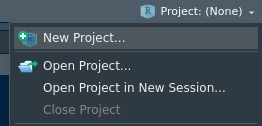
</center>

  2. Select **New Directory** Note that **Version Control** is reserved for when you already created a repo on GitHub. We will come back to this later.

<center>
  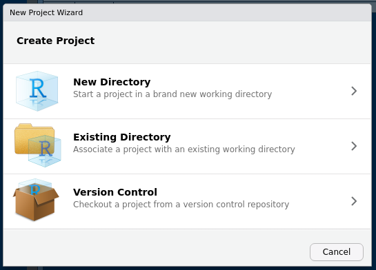{width=50%}
</center>

  3. Select **New Project**

<center>
  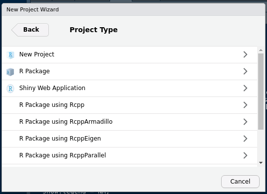{width=50%}
</center>

  4. Choose a new for your repo and a location. **Make sure that _create a git repository_ is checked**

<center>
  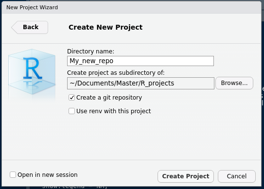{width=50%}
</center>

 5. You can now look under the *git tab*, you should see this: 
 
<center>
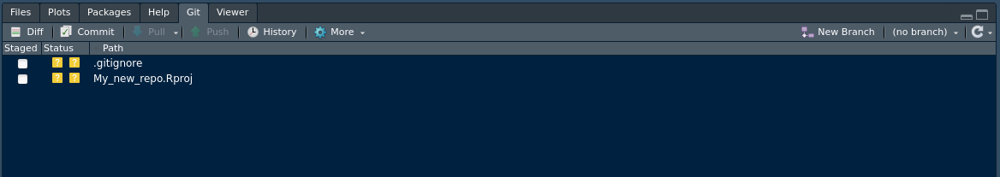

</center>

**Note: we will come back to what the _.gitignore_ file is later!**

***

> **Let's now create a new file, the first file we want to keep track of in this project**

#### At the terminal

We create a file using the `touch` command:

```{sh eval=FALSE, include=TRUE}
touch script_1.R    # Creates the file
```

#### In RStudio

Create a new file: go to the menu *File => New file => R Script*. Make sure to save it with the name *script_1.R*.

***

> **The repo is created and you have created a file, can git see the new file?**

#### At the terminal

With the `ls` command, which lists everything in your directory, you can see the file you have created. By editing the empty file and saving it, we created a change in this file. 

At any time, git lets you know if you have a untracked file, thanks to the `git status` command.

```{sh eval=FALSE, include=TRUE}
ls			   # This lists the files in the directory. You should see your file listed!
git status # Shows the current status of your repo with regards to git
```
```{}
On branch master

No commits yet

Untracked files:
  (use "git add <file>..." to include in what will be committed)

        script_1.R

nothing added to commit but untracked files present (use "git add" to track)
```

#### In RStudio

No need for the `status` command in RStudio, the *Git* tab shows you in real time the status of your files: 

 - Files that are **untracked** are represented by a **yellow question mark**.
 - Files that have been **added** (see next section) are represented by a **green A**
 - Files that have been **tracked and modified** are represented by a **blue M**.
 - Files that are *tracked but not modified* do not show.
 - Files that have been **deleted** are shown with a **red D**. 

***

> **By default, Git does not track anything. We need to tell it to do so. Let's do that now!** 

#### At the terminal

From the terminal, we can use the `git add` command. This tells git which file you care about and want to start tracking. This is called **Staging the file**.

```{sh eval=FALSE, include=TRUE}
git add script_1.R
git status    # Status now shows, in green, which changes have to be committed
```
```{}
On branch master

No commits yet

Changes to be committed:
  (use "git rm --cached <file>..." to unstage)

        new file:   script_1.R
```

#### In RStudio

In RStudio, this is as simple as "checking off" the file in the Git tab. This is called **Staging the file**.

<center>
  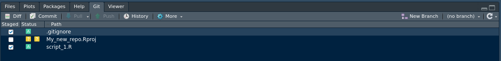
</center>

While you are at it, make sure to also check the `.gitignore file.` **What is a gitignore?** A gitignore is a file that lists the file you never want git to track. It can match certain file names (for instance, `.csv` or `.tif` files). This can be useful in case you need to make sure certain files (like data files or large files), do not get added.

***

> **Let's now make sure this new file is registered by git: this is called a _commit_** 

#### At the terminal

We have staged the file. Let's now take a snapshot of this file with the `git commit` command. It is important to add a useful message to your commit, a bit like a journal entry, so that you can remember what you committed. 

```{sh eval=FALSE, include=TRUE}
git commit -m "First commit - adding script1"   # the -m flag adds a message to a commit
```
```{}
[master (root-commit) 03a1fe9] First commit - adding script1
 1 file changed, 0 insertions(+), 0 deletions(-)
 create mode 100644 script_1.R
```

Another useful command: git `log` shows you the recent commit history. 

```{sh eval=FALSE, include=TRUE}
git log   # Git log shows you the history
```
```{}
commit 03a1fe9489631db018d4ae6d39560ce2e5e00ead (HEAD -> master)
Author: VLucet <valentin.lucet@gmail.com>
Date:   Wed Apr 8 18:19:53 2020 -0400

    First commit - adding script1
```

#### In RStudio

In Rstudio, committing is a few clicks away.

  1. Click on `commit` on the top of the file list.
  2. This window should appear:
  
<center>
  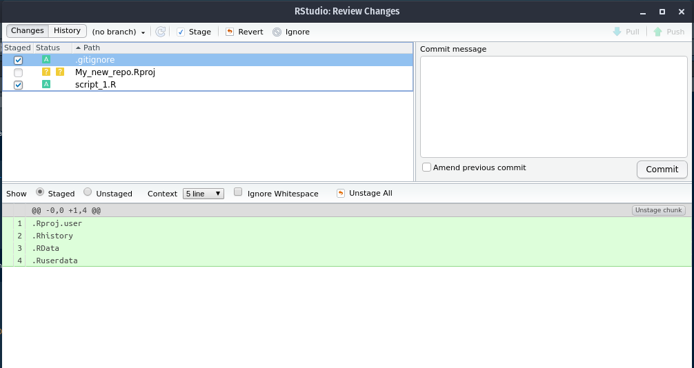{width=75%}
</center>

  3. Before committing anything you need to add a commit message. It is important to add a useful message to your commit, a bit like a journal entry, so that you can remember what you committed. 
  
<center>
  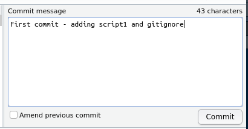{width=50%}
</center>

  4. Click on commit in order to commit the changes!

***

> **Let's now make some changes to this file and commit them** 

#### At the terminal

The code below opens the **nano** editor. [`Nano`](https://www.nano-editor.org/) is a simple command line file editor. Once the file is opened, you will see the (empty) content of the file.

```{sh eval=FALSE, include=TRUE}
nano script_1.R   # This opens the nano Text editor. 
```

Type in what you want. You can then close the editor with `ctrl+X`. Make sure to type `y` for yes and press `enter` to save the file. If you do not want to use the terminal for this (or do not have nano), you can just open the file in a file editor.

We now need to stage (`git add`) and commit (`git commit`)

```{sh eval=FALSE, include=TRUE}
git add -A    # This adds ALL (hence the -A) the changes you made to the git index. 
              # Your changes are now registered 
              # You could also just do git add script_1.R if you wanted to
git status    # Status now shows, in green, which changes have to be committed
```
```{}
On branch master
Changes to be committed:
  (use "git reset HEAD <file>..." to unstage)

        modified:   script_1.R
```


Now let's commit:

```{sh eval=FALSE, include=TRUE}
git commit -m "First commit - adding script1"	# the -m flag adds a message to a commit
```
```{}
[master (root-commit) e07b863] First commit - adding script1
 1 file changed, 1 insertion(+)
 create mode 100644 script_1.R
```


#### In RStudio

 1. Open your file in the editor, and add some modifications. Make sure to save it. When you open the git tab, you should see the following:

<center>
  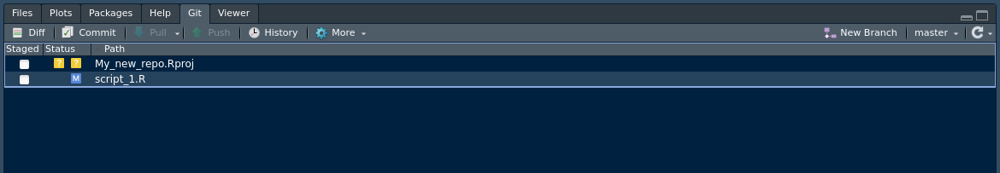
</center>

  2. Now, *Stage the file* by chekcing it.

<center>
  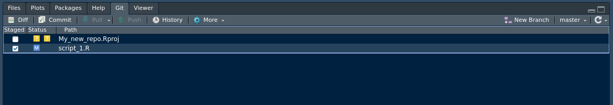
</center>

  3. Then, make sure you commit once again.

<center>
  
</center>

**Note**: take a look at the **history** tab in the commit window.

***

Note that once you have staged a file, you could do more changes, and you would need to re-run `git add` to add them to the index. Those changes not yet fully registered by git, they are like a draft, not untiil you commit. When you want to take a snapshot of a file, it means you are ready to commit that change to the index.

This image summarises what we have learned so far. Each change in the repository (adding a file, modifying a file, etc...) needs to be staged before it is commited. 

<center>
{width=65%}
</center>

------

### *Exercise 2* All roads lead to GitHub: how to add a remote

After having created a repo on your local machine (and provided that you have configured git on your computer), you will be able to link your repo to GitHub, an online hub for repositories. 

"Linking" can mean multiple things depending on where you start things.

We call this **pushing**. After pushing, a copy of your repo will live on the github servers and will remain linked to the original copy. The GitHub copy is called a **remote**. 

***

> We first need to create the remote repository on [GitHub](github.com)

The first thing to do is to create the remote: 

  1. log in
	
  2. click on the green folder.

<center>
  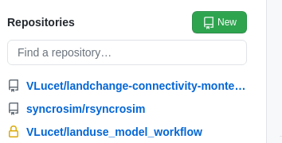
</center>

  3. Give a name to your repo. It's good practice to the use the same name than your local git repo (it's also easier to remember that way!). **Do not** add a `README.md` or `.gitignore`. The repo needs to be an **empty repo**.
  
<center>
  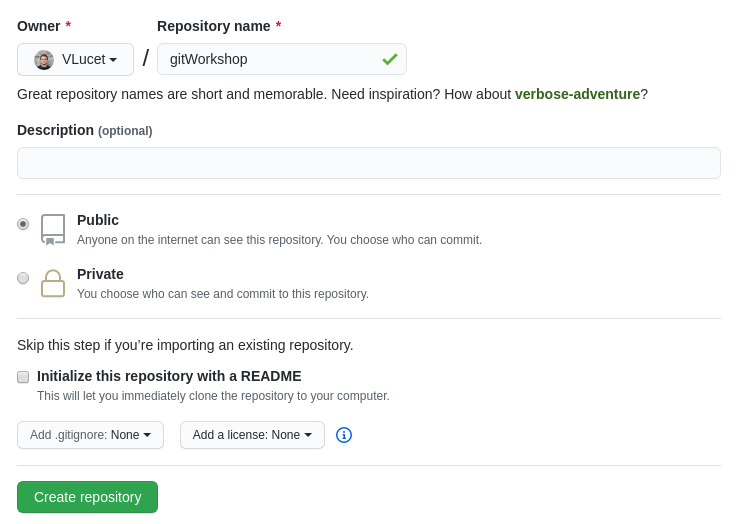{width=75%}
</center>

The next thing is to tell your local git that you have created a new remote. You will name this the **origin** remote. Why **origin**? Because from the point of view of project development, you want this online repo to be the origin of all future work, and you want the online version to save all that matters!

***

> Let's now link your local repo with the GitHub "remote"

#### At the terminal

1. Tell git the address of your remote

```{sh eval=FALSE, include=TRUE}
git remote add origin https:...	  # Add here the URL of your git repo, 
                                  # for instance https://github.com/VLucet/gitWorkshoptest
```

2. You now need to upload your repo to the remote, i.e. to **push** your commits. The first time you push, you have to tell git that the remote is an **upstream branch** (more on that later).

```{sh eval=FALSE, include=TRUE} 
 git push --set-upstream origin master    # This pushes and sets the remote as "upstream"
```
```{}
Enumerating objects: 3, done.
Counting objects: 100% (3/3), done.
Writing objects: 100% (3/3), 263 bytes | 263.00 KiB/s, done.
Total 3 (delta 0), reused 0 (delta 0)
To https://github.com/VLucet/gitWorkshop
 * [new branch]      master -> master
Branch 'master' set up to track remote branch 'master' from 'origin'.
```
```{sh eval=FALSE, include=TRUE}
 git push   # If you try to push again, 
            # it will tell you that everything is up to date!
```
```{}
Everything up-to-date
```
There you go! you now have a copy of your repo on GitHub. Well done!

#### In RStudio

1. In Rstudio you have to click to the **New Branch** button in the git pane, in the top right corner of the pane: 

<center>
  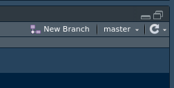{width=50%}
</center>

2. The dialogue window should open, click on **add remote**

<center>
  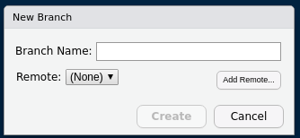{width=50%}
</center>

3. Put **origin** as the remote name. Why **origin**? Because from the point of view of project development, you want this online repo to be the origin of all future work, and you want the online version to save all that matters! Put the also address of your repo (for instance for me it is `for instance https://github.com/VLucet/gitWorkshoptest`)

<center>
  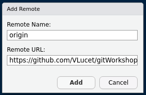{width=50%}
</center>

4. Back to the previous dialogue box, write **master** as the main branch and make sure to tick the box **sync branch with remote**.

<center>
  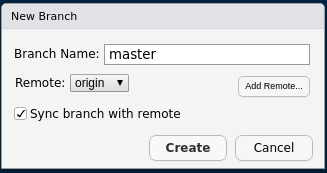{width=50%}
</center>

5. You can now push your commits by clicking on the **push** button. You can go to to your repo to see the changes.

<center>
  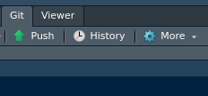{width=50%}
</center>

There you go! you now have a copy of your repo on GitHub. Well done! Fron now on you can continue to **add**, **commit** and **push** your commits.

<!-- **Note:** it is also possible to start the repo on GitHub and download a **clone**. It is the opposite operation (see exercise 4). -->

------

### *Exercise 3* Team Work makes the Dream Work: collabaring with git

Git is made for collaboration. In one image, this can be summarized like this:


Form teams of 3. The youngest of the team will be the repo owner for this exercise. 

- Repo Owner, head over to github to create a new online repository. 
	- This time, make sure to initiate this repository with a **ReadMe** file. A `ReadMe` file is an important file for a repo, as it is there to describe the purpose of the repo and contains important metadata on that repo.
- In the `ReadMe`, type in the name of your favorite movie or TV show.
- Next step is for you to make a team by **inviting collaborators**.
  - Navigate to your repo settings. 
  - Go to `Manage Access` and click `invite a colaborator`
  - Add the members of your team by typing in their **GitHub Username**.  
- You can now all clone the repo. You can use GitHub desktop or the command line. Using the command line: 
```{sh eval=FALSE, include=TRUE}
cd ~ 			# Navigate to your home folder again 
git clone *URL* 	# The URL of the repo created by the repo owner
```
Well done, you have no set up a team and you are now technically working on the same repo.

------

### *Exercise 4* (Do The) Push and Pull: how to

You are now ready to do yur first round of **pushing and pulling**.

To do so, we are going to use the repo you cloned at the previous exercise. The first step is to make sure you are up to date with the version of  the repo that is on GitHub. To do so, we use the `fetch` command. 

```{sh eval=FALSE, include=TRUE} 
git fetch  # Fetch compares your local version with the remote version but does not apply the new changes (if there are any)
```

The next step is for one of the team members (other than the repo owner) to make a change. Make a change to the Readme file for instance (maybe you teammate's favorite movie is *not* Sharknados 3. They'd be wrong, but still, they're welcome to change that...).

```{sh eval=FALSE, include=TRUE}
nano README.md	# Reminder: nano is the console editor
```

Then, add, commit and push those changes

```{sh eval=FALSE, include=TRUE}
git add -A 				# Once again, add all the changes
git commit -m "modified the README"	# Always add a useful message (unless it's 2:32am and then you can just say "gazoub."
```

```{}
[master 58c8cb7] modified the README
 1 file changed, 1 insertion(+), 1 deletion(-)
```

```{sh eval=FALSE, include=TRUE}
git push origin master			# Push it!
```

```{}
Enumerating objects: 5, done.
Counting objects: 100% (5/5), done.
Delta compression using up to 12 threads
Compressing objects: 100% (2/2), done.
Writing objects: 100% (3/3), 313 bytes | 313.00 KiB/s, done.
Total 3 (delta 0), reused 0 (delta 0)
To github.com:VLucet/gitWorkshop.git
   a992c9a..58c8cb7  master -> master
```

Now, two of the team members are not in sync with the changes. These people can see it with a `fetch`. Below I cannot show the outputs but you should a little familiar with these by now!

```{sh eval=FALSE, include=TRUE}
git fetch	# This will download the changes pushed by your team member
git status	# Always good to run status once in a while. Here it will tell you that you are 1 commit behind! 
```

To remedy to this, it is as simple as **pulling** the changes in your local repo. 

```{sh eval=FALSE, include=TRUE}
git pull origin master	# Nice! Git will print a nice summary with green + and red -. How cute. 
```

Well done! You now know how to **push** and **pull**, **fetch** and **status** your way around a shared repo. You're the best.

------

### *Exercise 5* Git of war: conflicts and how to resolve them

Now, let's do it again but a little differently. The one person in the group to not have edited the `README` should do it now on their machine. Please add and commit but **do not push yet**.

```{sh eval=FALSE, include=TRUE}
git add -A 				# Once again, add all the changes
git commit -m "modified the README"	# Do not push!
```

Now, repo owner will go on github and change the file. There are many types of files that can be edited directly on GitHub, and the README file is one of them. For this exercise, please change the same line than the previous person. Commit the change to the repo.

Now, the person to have just changed the file on their machine will do the pulling procedure:

```{sh eval=FALSE, include=TRUE}
git fetch 	# This fetches the changes
git status 	# WOW! Status says that the commits are different... this might cause a problem
git pull 	# There is now a "conflict" and you need to resolve it
```

You've created a conflict. A conflict typically happens when you have commited a local change and are pulling a commit from remote that was made on that same line of code you just changed. See it illustrated below: 


Git doesn't know which changes to keep and which one to throw away. We need to make a choice: we call that doing a "commit merge". As illistrated below, git will compare the two streams of information:


You have 2 options: you can use the nano editor: or you can use a combination of GitHub Desktop/External editor. The Atom editor is especially useful. If using `nano`:

```{sh eval=FALSE, include=TRUE}
nano *file*	# Opens file in nano 
```

When you open the conflicted file you will see code that is enclosed within `<<<<<<< HEAD` and `=======`. This corresponds to your local version of this line of code. Then between `=======` and `>>>>>>> 3f74688ab...` is the version corresponding to the commit (with the hash `3f74688ab...`) that you pulled from remote. You need to edit the file so that these various things, `<<<<<<< HEAD` and `=======` and `>>>>>>> 3f74688ab...` are no longer there. You can choose to keep either of the changes or both. 

Once you have made your changes, it is time to commit your change, and merge it with the remote repo. 

```{sh eval=FALSE, include=TRUE}
git add -A 				# Once again, add all the changes
git commit -m "fixed the conflict"	# You fixed the conflict, better put a messgae indicating it!
git push origin master			# Push it!
git status				# All is good!
```

Well done! You've learned how to deal with conflicts!

In addition, git clients like GitHub Desktop or GitKraken have their own editor for conflicts (demo).

------

### *Exercise 6* The tree of git: branching, the basics

A great way to make conflicst much more manageable is to use the magic of branching. Branches are like alternate timelines that allow you to work on a snapshot of the repo at a given time. You start by "branching out of the master branch": this copies the current version of the repo and allows you to make changes on a separate "branch". 

One of the team members should do the following. The first thing is to create the branch:

```{sh eval=FALSE, include=TRUE}
git branch mynewbranch		# This simply creates the new branch
```

The branch is created, but you are still on the master branch. To be able to switch to the new branch, we need to "checkout' the branch:

```{sh eval=FALSE, include=TRUE} 
git checkout mynewbranch	# This makes you switch to the new branch
```

```{}
Switched to branch 'mynewbranch'
```

```{sh eval=FALSE, include=TRUE} 
git status 			# You are now on the new branch
``` 

```{}
On branch mynewbranch
nothing to commit, working tree clean
```

***note***: *there is a shortchut to do those 2 commands in one line: `git checkout -b mynewbranch`*
You are now on the new branch! This branch is only on your local machine for now. Let's add some changes and then commit and push so that you branch is saved on the remote!

```{sh eval=FALSE, include=TRUE}
# Do some changes in your repo! They will only be part of the commit hostory of your branch
git commit -a -m 'added some changes to the new branch'  # Another shorcut to add and commit at the same time!
```

```{}
[mynewbranch 92b76fb] added some changes to the new branch
 1 file changed, 1 insertion(+)
```

```{sh eval=FALSE, include=TRUE}
git push origin mynewbranch    # Pushing to the new branch - you can also just type in "git push"
```

```{}
Enumerating objects: 5, done.
Counting objects: 100% (5/5), done.
Delta compression using up to 12 threads
Compressing objects: 100% (2/2), done.
Writing objects: 100% (3/3), 338 bytes | 338.00 KiB/s, done.
Total 3 (delta 0), reused 0 (delta 0)
remote:
remote: Create a pull request for 'mynewbranch' on GitHub by visiting:
remote:      https://github.com/VLucet/gitWorkshop/pull/new/mynewbranch
remote:
To github.com:VLucet/gitWorkshop.git
 * [new branch]      mynewbranch -> mynewbranch
```

Awesome! Now, while one of the team member is adding commits to their new branch, someone else should keep adding changes to the master branch. Once this is done, it is time to merge the new branch with the master branch. 

Merging means doing a "pull request": you are pulling the new branch into the master branch. You therefore need to checkout the master branch and then *pull* the new branch into the master.

```{sh eval=FALSE, include=TRUE}
git checkout master	# You've switched to the master branch
```

```{}
Switched to branch 'master'
Your branch is up to date with 'origin/master'.
```
```{sh eval=FALSE, include=TRUE}
git merge mynewbranch	# this merges (opens a pull request and checks it against the master)
```

```{}
Updating 58c8cb7..92b76fb
Fast-forward
 script_1.R | 1 +
 1 file changed, 1 insertion(+)
```

```{sh eval=FALSE, include=TRUE}
git push 		# this pushes the merging of the two branches 
```

```{}
Total 0 (delta 0), reused 0 (delta 0)
To github.com:VLucet/gitWorkshop.git
   58c8cb7..92b76fb  master -> master
   
```

Additionally, you can do all this by creating a pull request on github (**DEMO**). 

------

### DEMO: Gitkraken

DEMO of the git client GitKraken if time permits. Otherwise, see [this video](https://www.youtube.com/watch?v=ub9GfRziCtU). This video actually also covers more advanced topics, but you can use it to get a feel for where in the interface the buttons for adding (staging), committing and pushing/pulling are.

------